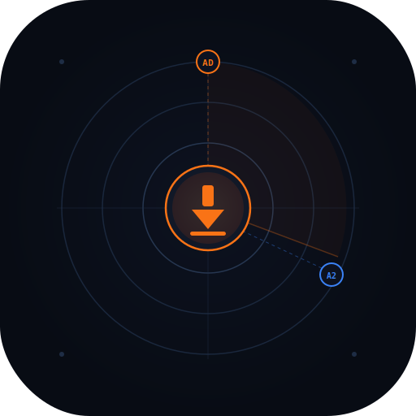
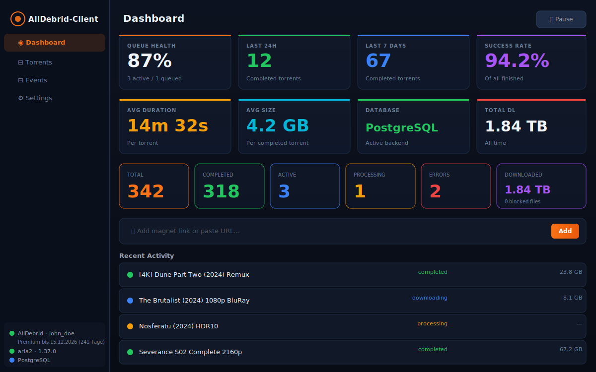
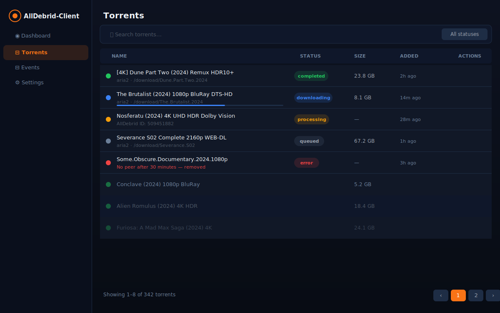
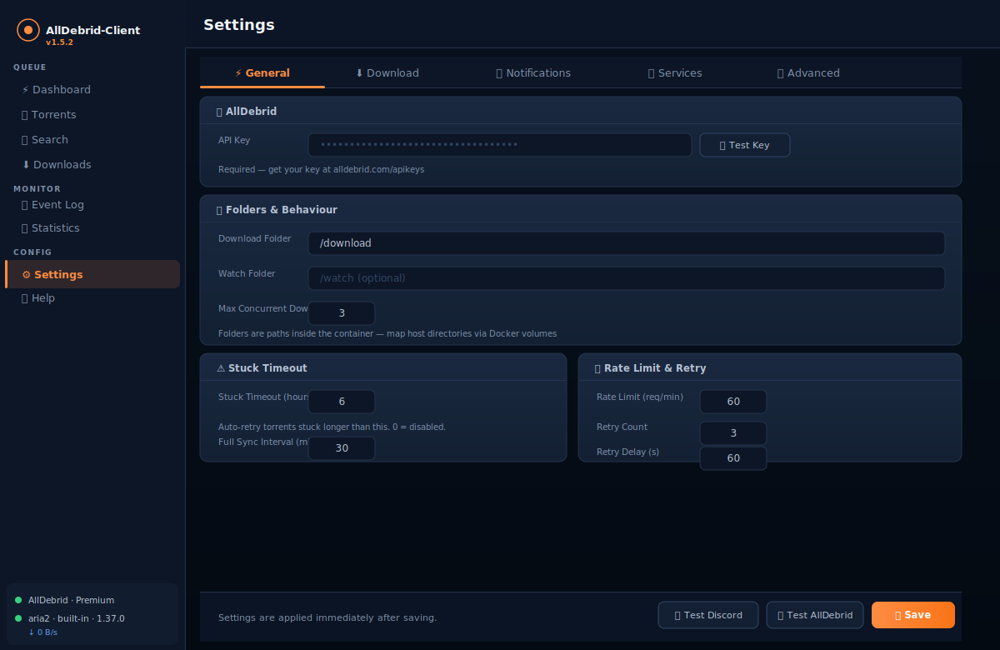

<div align="center">
  
  <h1>AllDebrid-Client</h1>
  <p><strong>Self-hosted torrent automation via AllDebrid</strong><br/>Web UI · aria2 delivery · Discord notifications · PostgreSQL support · FlexGet integration</p>

  [](https://github.com/kroeberd/alldebrid-client/releases)
  [](https://hub.docker.com/r/kroeberd/alldebrid-client)
  [](LICENSE)
  [](https://github.com/kroeberd/alldebrid-client/actions/workflows/tests.yml)
  [](https://github.com/kroeberd/alldebrid-client/actions/workflows/tests.yml)
</div>

---

## What it does

AllDebrid-Client automates the full torrent lifecycle via your AllDebrid account:

1. **Add** magnet links via the web UI, watch folder, Sonarr/Radarr, or REST API
2. **Upload** to AllDebrid and poll until the torrent is ready
3. **Unlock** download links and submit them to aria2
4. **Monitor** aria2 until all files complete, then mark done and remove from AllDebrid
5. **Notify** via Discord with rich embeds for every event

---

## Screenshots

| Dashboard | Torrents | Settings |
|-----------|----------|----------|
| [](docs/screenshots/dashboard.svg) | [](docs/screenshots/torrents.svg) | [](docs/screenshots/settings.svg) |

---

## Quick Start

### Docker Compose (recommended)

```bash
git clone https://github.com/kroeberd/alldebrid-client.git
cd alldebrid-client
docker compose up -d
```

Open **http://localhost:8080** → Settings → enter your AllDebrid API key.

### Docker run

```bash
docker run -d \
  --name alldebrid-client \
  --restart unless-stopped \
  -p 8080:8080 \
  -v /path/to/config:/app/config \
  -v /path/to/downloads:/download \
  kroeberd/alldebrid-client:latest
```

### Unraid

Image: `kroeberd/alldebrid-client:latest` · Port: `8080`

---

## Features

### Core
- 🔄 **Automatic lifecycle** — upload → poll → unlock → aria2 → done → Discord
- 📁 **Watch folder** — automatically process `.torrent` and `.magnet` files
- 🎯 **Slot-based aria2 queue** — configurable concurrent download limit
- 🔁 **Full-Sync** — regular reconciliation of all torrents against AllDebrid (every 5 min)
- 🚫 **File filters** — block by extension, keyword, or minimum size

### Notifications
- 🔔 **Discord** — rich embeds for add / complete / error / partial events
- 🤖 **FlexGet integration** — trigger tasks manually or on a schedule (FlexGet v3 API)
- 🌐 **Webhook events** — FlexGet-specific webhooks (run_started, task_ok, task_error, run_finished)

### Database & Reliability
- 🗄️ **SQLite** (default, no setup) or **PostgreSQL** (external)
- 🔄 **Startup sync** — automatically copies missing SQLite rows to PostgreSQL on startup
- 🛡️ **Automatic fallback** — continues with SQLite if PostgreSQL is unreachable
- 💾 **Automatic backups** — configurable interval and retention

### Integrations
- 📺 **Sonarr / Radarr** — import trigger after download completes
- 📊 **Statistics module** — comprehensive metrics, time windows, JSON export
- 🔑 **PostgreSQL migration** — bidirectional, dry-run testable

---

## Configuration

All settings via the web UI under **Settings** (10 tabs):

| Tab | Settings |
|-----|----------|
| ⚡ **General** | AllDebrid API key, agent name, folder paths |
| ⬇️ **Download** | aria2 RPC URL, secret, download root, max concurrent |
| 🔔 **Discord** | Bot name, avatar, webhook URLs, notification toggles |
| 🔗 **Integrations** | Sonarr, Radarr |
| 🗄️ **Database** | SQLite / PostgreSQL, migration |
| 🚫 **Filters** | Blocked extensions, keywords, minimum file size |
| ⏱ **Polling** | AllDebrid interval, full-sync interval, watch folder |
| 💾 **Backup** | Automatic backups, interval, retention |
| 🤖 **FlexGet** | URL, API key, tasks, schedule, jitter, webhook |
| 📊 **Reporting** | Statistics snapshots, time window, export |

### Environment variables

| Variable | Default | Description |
|----------|---------|-------------|
| `CONFIG_PATH` | `/app/config/config.json` | Settings file path |
| `DB_PATH` | `/app/data/alldebrid.db` | SQLite database path |
| `TZ` | `Europe/Berlin` | Container timezone |
| `DB_TYPE` | — | Set to `postgres` to enable PostgreSQL |
| `LOG_LEVEL` | `INFO` | Set to `DEBUG` for verbose logs |

---

## PostgreSQL

See [docs/postgresql.md](docs/postgresql.md) for setup instructions and migration guide.

**Quick setup:**

```yaml
# docker-compose.yml environment
environment:
  DB_TYPE: postgres
  # Configure connection in Settings → Database
```

---

## FlexGet Integration

FlexGet v3 is controlled via its REST API:

```yaml
# FlexGet config.yml
web_server:
  bind: 0.0.0.0
  port: 5050
```

```bash
flexget web gentoken   # generate API token
```

Enter the token in Settings → 🤖 FlexGet. Tasks are executed via `POST /api/tasks/execute/`.

---

## REST API

| Method | Path | Description |
|--------|------|-------------|
| `GET` | `/api/stats` | Queue health, counters, averages |
| `GET` | `/api/stats/comprehensive?hours=N` | Comprehensive statistics |
| `GET` | `/api/stats/export?hours=N` | JSON export |
| `GET` | `/api/torrents` | All torrent records |
| `POST` | `/api/torrents/add-magnet` | Add magnet link |
| `DELETE` | `/api/torrents/{id}` | Delete torrent |
| `POST` | `/api/torrents/{id}/retry` | Retry torrent |
| `GET` | `/api/events` | Event log |
| `POST` | `/api/admin/full-sync` | Full AllDebrid reconciliation |
| `POST` | `/api/admin/deep-sync` | aria2 filesystem reconciliation |
| `POST` | `/api/admin/migrate` | SQLite ↔ PostgreSQL migration |
| `POST` | `/api/flexget/run` | Execute FlexGet tasks |
| `GET` | `/api/flexget/tasks` | List FlexGet tasks |
| `GET` | `/api/flexget/history` | FlexGet run history |

---

## Development

```bash
# Backend (Python 3.12+)
cd backend
pip install -r requirements.txt
uvicorn main:app --reload --port 8080

# Tests (50 unit tests)
python -m pytest tests/test_manager_v2.py -v
```

### Project structure

```
backend/
  api/routes.py          # FastAPI endpoints
  core/config.py         # Settings model (Pydantic)
  core/scheduler.py      # Poll loops (AllDebrid, aria2, FlexGet, Stats)
  db/database.py         # SQLite/PostgreSQL abstraction (_DbConnection)
  db/migration.py        # Bidirectional migration
  services/
    alldebrid.py         # AllDebrid API client
    aria2.py             # aria2 JSON-RPC client (serialised, rate-limited)
    flexget.py           # FlexGet v3 REST client
    manager_v2.py        # Core orchestration (TorrentManager)
    notifications.py     # Discord webhook service
    stats.py             # Statistics and reporting module
    backup.py            # Automatic backups
    integrations.py      # Sonarr/Radarr integration
  tests/
    test_manager_v2.py   # 50 unit tests
frontend/
  static/index.html      # Single-file web UI (vanilla JS)
docs/
  logo.svg               # App logo
  postgresql.md          # PostgreSQL setup guide
  migration.md           # Migration guide
  discord-webhooks.md    # Discord configuration
  screenshots/           # UI screenshots
```

---

## Changelog

See [CHANGELOG.md](CHANGELOG.md) for full release history.

---

## License

MIT — see [LICENSE](LICENSE)
